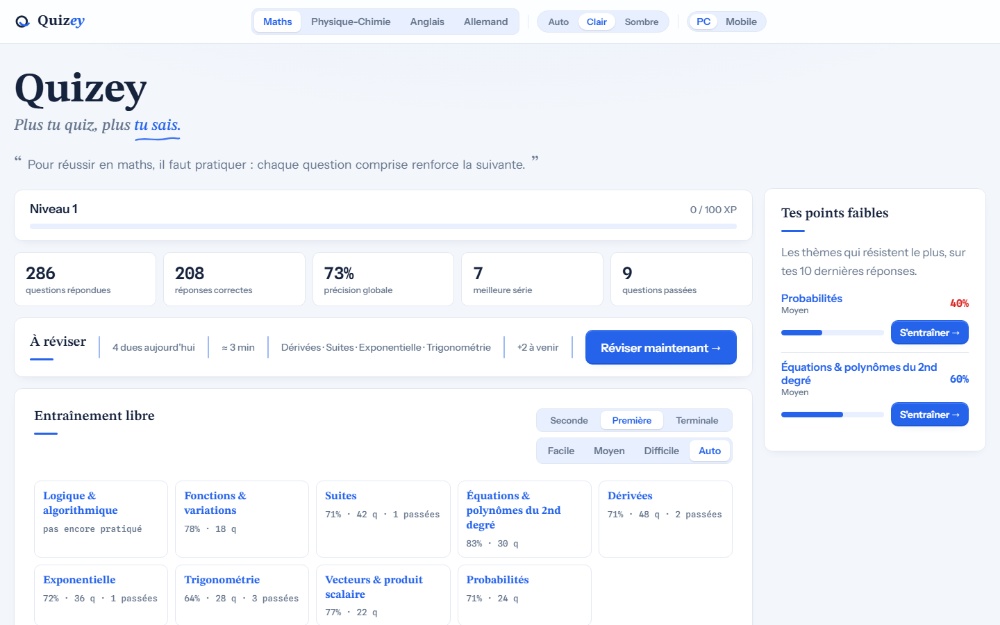
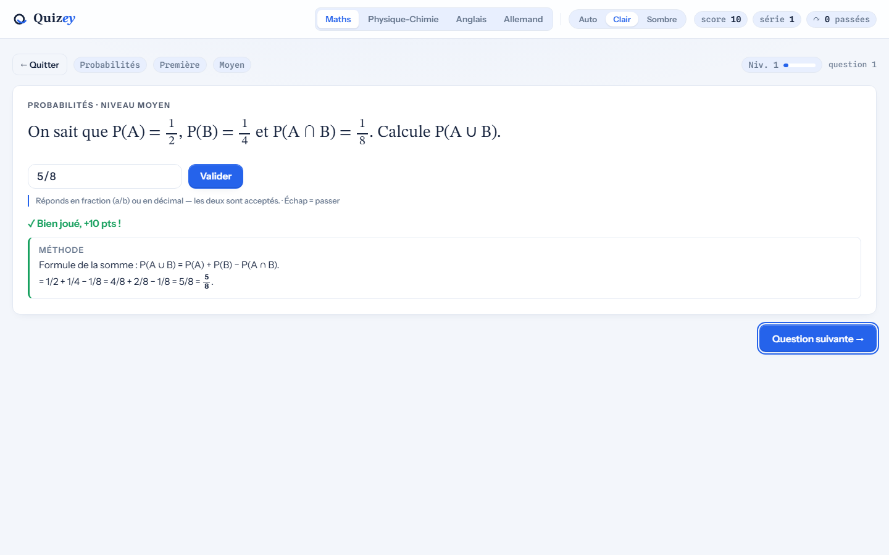
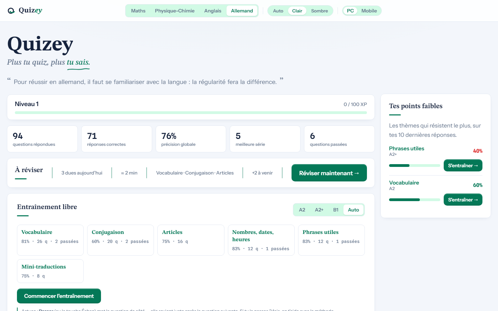

# Quizey

**Plus tu quiz, plus tu sais.**

_Élève en Terminale, j’avais à l’origine conçu cette application pour mes propres besoins. J’ai ensuite pensé qu’elle pourrait également servir à d’autres élèves soucieux de progresser. _

Quizey, c'est la révision du lycée dans votre navigateur. Un seul fichier à ouvrir, pas de compte, pas d'installation, et rien de ce que vous faites ne quitte votre machine.



## Particularité

- **Programmes officiels** — Les maths et la physique-chimie suivent les programmes officiels de chaque année. Les langues couvrent A2, A2+ et B1.
- **Révision par répétition espacée** — Une méthode éprouvée : les questions que vous ratez reviennent, tandis que celles que vous maîtrisez sont espacées par l’algorithme.
- **Corrigés pédagogiques** — Chaque réponse est expliquée par la méthode, avec un dessin quand c'est possible.
- **Vos points faibles** — Quizey repère où vous réussissez le moins et vous propose de vous y entraîner.

## Contenu

- **Mathématiques** (spécialité) — Seconde · Première · Terminale, avec en Terminale une option de chapitres avancés (« Maths expertes »).
- **Physique-chimie** (spécialité) — Seconde · Première · Terminale.
- **Allemand** et **Anglais** — Trois niveaux (A2 · A2+ · B1), avec des questions à choix multiples.



## Utilisation

1. Choisissez une **matière**, une **année** (ou un niveau pour les langues) et un **thème** ou laissez Quizey vous proposer un mélange.
2. Répondez à votre rythme, l'algorithme s'occupe de tout.
3. Revenez quand vous voulez : votre liste « à réviser » est toujours là, avec un aperçu du temps qu'elle représente.

Le bouton « Passer » n'est pas pénalisant : il vous permet de retrouver la question plus tard.



## Quizey est fait pour vous motiver

Chaque matière a son propre niveau. Chaque bonne réponse vous fait gagner de l'expérience, et à chaque palier une petite animation vous félicite.

## Installation

**Dans la console / terminal**

```bash
git clone https://github.com/Cidbzh/Quizey.git
```

puis ouvrez `Quizey/Quizey.html` (double-clic).

**Depuis les releases**

Téléchargez le fichier depuis la page [Releases](https://github.com/Cidbzh/Quizey/releases), puis double-cliquez sur `Quizey.html`.

Une fois en votre possession, le fichier vous appartient : clé USB, médiathèque, labo du lycée (où que vous soyez, avec ou sans internet).

## Licence

MIT — voir le fichier `LICENSE`.
